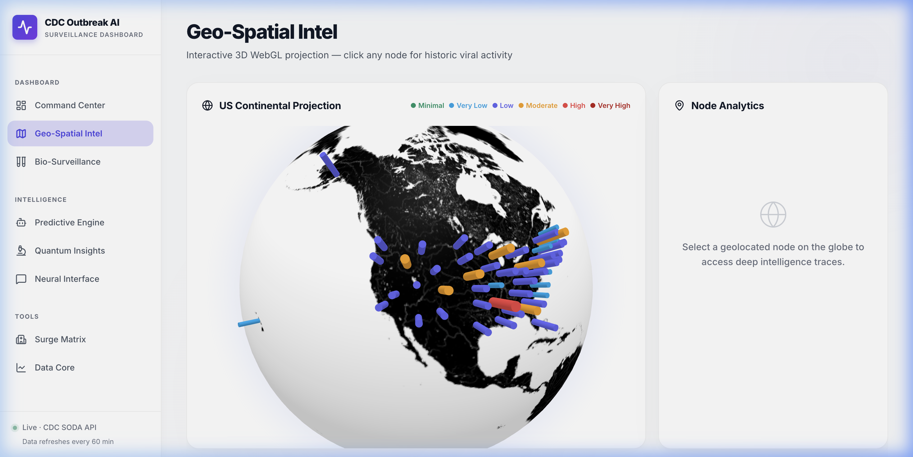

<div align="center">
  
# 🦠 CDC Outbreak AI: Web-Scale Epidemiological Intelligence Platform

**An advanced, real-time public health surveillance dashboard powered by AI, Machine Learning, and the CDC SODA API.**

[](https://reactjs.org/)
[](https://fastapi.tiangolo.com/)
[](https://www.python.org/)
[](https://duckdb.org/)
[](https://www.framer.com/motion/)
[](https://get.webgl.org/)

</div>



---

## Executive Summary
The **CDC Outbreak AI Dashboard** is a premium, full-stack analytical platform designed to monitor, analyze, and predict the spread of respiratory viruses (COVID-19, Influenza, RSV) across the United States. 

By autonomously ingesting millions of rows of open data from the CDC's internal databases, this platform transforms raw tabular data into accessible, high-fidelity intelligence. It bridges the gap between complex epidemiological data and actionable insights, making it an invaluable tool for public health officials, healthcare administrators, and the general public.

---

## 🧠 Core Analytical Features & Technical Showcase

This project serves as a comprehensive demonstration of advanced data science, data engineering, and data visualization capabilities:

### 1. 🌐 Geo-Spatial Intelligence (3D WebGL)
*   **For Non-Tech:** A stunning, interactive 3D globe that visualizes outbreak hotspots across the U.S. in real-time.
*   **For Tech:** Implemented using `react-globe.gl` and WebGL to render massive geospatial datasets at 60+ FPS without browser lag. Integrates choropleth coloring schemas mapped directly to normalized risk indices (0-5 scale).

### 2. 🤖 Predictive Engine (LSTM Deep Learning)
*   **For Non-Tech:** AI that looks at past outbreaks and predicts how many people will be hospitalized over the next month, helping hospitals prepare.
*   **For Tech:** A Long Short-Term Memory (LSTM) recurrent neural network built in PyTorch. It features a sliding-window time-series architecture, utilizing lag features (`Lag-1`, `Lag-2`), 4-week rolling averages, and cyclical seasonal embeddings (Sine/Cosine transformations) to forecast hospitalization rates with measurable Mean Absolute Error (MAE).

### 3. 🧪 Bio-Surveillance (Wastewater Tracking)
*   **For Non-Tech:** Monitors virus levels in city sewage systems—acting as an early warning system that detects outbreaks 1-2 weeks *before* hospital visits spike.
*   **For Tech:** Processes complex, high-cardinality multi-site timeseries data. Utilizes data warehousing techniques (via DuckDB) to perform efficient rolling aggregations and group-by operations on thousands of municipal treatment plant records.

### 4. 🧠 Neural Interface (RAG & LLM Integration)
*   **For Non-Tech:** A ChatGPT-like assistant that lets you ask questions about the data in plain English (e.g., "Which state has the worst flu outbreak right now?").
*   **For Tech:** Implements Retrieval-Augmented Generation (RAG). It vectorizes structured data queries and feeds them as context into an open-source LLM (Mistral-7B/Llama-3), acting as an autonomous SQL-to-Text inference layer.

### 5. 🏥 Capacity Simulator (Monte Carlo Modeling)
*   **For Non-Tech:** A "what-if" simulator that helps hospitals figure out if they will run out of beds during a massive viral surge.
*   **For Tech:** A stochastic Monte Carlo simulation engine. It runs 1,000 parallel probabilistic simulations based on current infection vectors and historic variance to output confidence intervals (95% CI) for expected resource demand.

### 6. 📊 Quantum Insights (Deep Analytics)
*   **For Non-Tech:** Deep-dive charts comparing how different viruses are spreading this year compared to last year.
*   **For Tech:** Complex multivariate EDA (Exploratory Data Analysis) materialized via Plotly.js. Handles season-over-season alignment, handling missing data interpolation, and computing test-positivity ratios on the fly.

---

## 🏗️ System Architecture

### Backend: The Data Pipeline
The backend is a high-performance API built with **Python (FastAPI)**.
*   **Data Ingestion:** Asynchronous CRON-like tasks fetch the latest datasets from the CDC SODA API (Socrata Open Data API).
*   **Data Warehousing:** Uses **DuckDB**, an ultra-fast in-process analytical database, allowing for complex SQL aggregations on hundreds of megabytes of data in milliseconds.
*   **Data Cleaning:** Leverages `pandas` for handling missing values, standardizing datetime formats, and normalizing schema variations before database insertion.

### Frontend: The Presentation Layer
The frontend is a React SPA (Single Page Application) built with Vite.
*   **Aesthetic:** A premium "Matte Light Mode" UI inspired by enterprise BI tools (Tableau, PowerBI, Palantir Foundry).
*   **Animation:** Buttery-smooth transitions and scroll/hover intelligence powered by **Framer Motion**.
*   **Interactivity:** A custom-built global cursor engine that magnetically reacts to data nodes and interactive elements.

---

## 🛠️ Skills Demonstrated (Data Analyst Portfolio)

*   **Data Engineering:** API Integration (CDC SODA), ETL Pipeline creation, Database Design (DuckDB/SQL).
*   **Data Science / Machine Learning:** Time-series Forecasting (LSTM networks), Feature Engineering, Probabilistic Modeling (Monte Carlo).
*   **Data Analytics:** Statistical Aggregation, A/B Variance Tracking, Anomaly Detection.
*   **Data Visualization:** Interactive 3D WebGL (react-globe), Plotly.js, intuitive UI/UX design, translating complex data into executive summaries.
*   **Software Engineering:** Python, React, FastAPI, Git version control, Full-Stack Deployment.

---

## 🚀 How to Run Locally

### Prerequisites
*   Python 3.10+
*   Node.js 18+

### 1. Setup Backend
```bash
cd backend
python -m venv venv
source venv/bin/activate  # Or `venv\Scripts\activate` on Windows
pip install -r requirements.txt

# Start the FastAPI server (runs on http://localhost:8000)
uvicorn main:app --reload
```

### 2. Setup Frontend
```bash
cd frontend
npm install

# Start the Vite development server (runs on http://localhost:5173)
npm run dev
```

---
*Created by a passionate Data Scientist and Analyst, built to push the boundaries of modern web-based data storytelling.*
